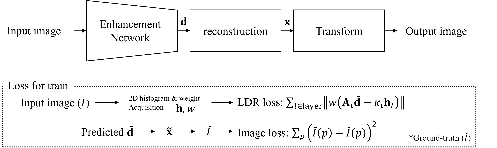

# LDRloss

LDR loss for image enhancement network 
 └ Layered Difference Representation loss

# Tested Environment 
* Python = 3.12.1
* Torch = 2.2.0 including cuda 12.1 and cudnn 8.0

# Datasets
MIT-Adobe 5K: Original link is <a href="https://data.csail.mit.edu/graphics/fivek/"> here </a>  
LOL-v2: Original link is <a href="https://github.com/flyywh/CVPR-2020-Semi-Low-Light"> here </a>  
Mixed dataset is comprised of LOL-v2 and FiveK (we update this soon)

# Train
you can train using LDRM_NET.py
train dataset should be include "input and gt folder"  
e.g.) train/input 
&nbsp;&nbsp;&nbsp;&nbsp;&nbsp;&nbsp;&nbsp;&nbsp;&nbsp;&nbsp;&nbsp;&nbsp;&nbsp;&nbsp;               /gt 

# Test 
You can test using Test.py

# Pretrained Model
We will update soon. 

# Citation 
We will update soon. 
